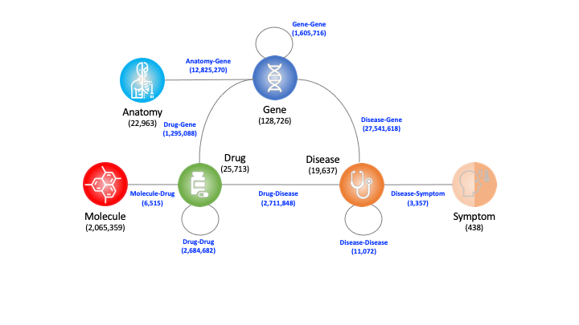

# Comprehensive Biomedical Knowledge Hub (CBKH)
Introduction

## Materials and Methods

## Statistics of CBKH
| Entity Type    | Number    |
| ---------------|:---------:|
| Anatomy        | 22,963    |
| Disease        | 19,637    |
| Drug           | 25,713    |
| Gene           | 128,726   |
| Molecule       | 2,065,359 |
| Symptom        | 438       |
| **Total Entities** | **2,262,836** |

| Relation Type   |	Number     |
| ----------------|:----------:|
| Anatomy-Gene	  | 12,825,270 |
| Drug-Disease	  | 2,711,848  |
| Drug-Drug	      | 2,684,682  |
| Drug-Gene	      | 1,295,088  |
| Disease-Disease	| 11,072     |
| Disease-Gene	  | 27,541,618 |
| Disease-Symptom	| 3,357      |
| Gene-Gene	      | 1,605,716  |
| **Total Relations** | **48,678,651** |
